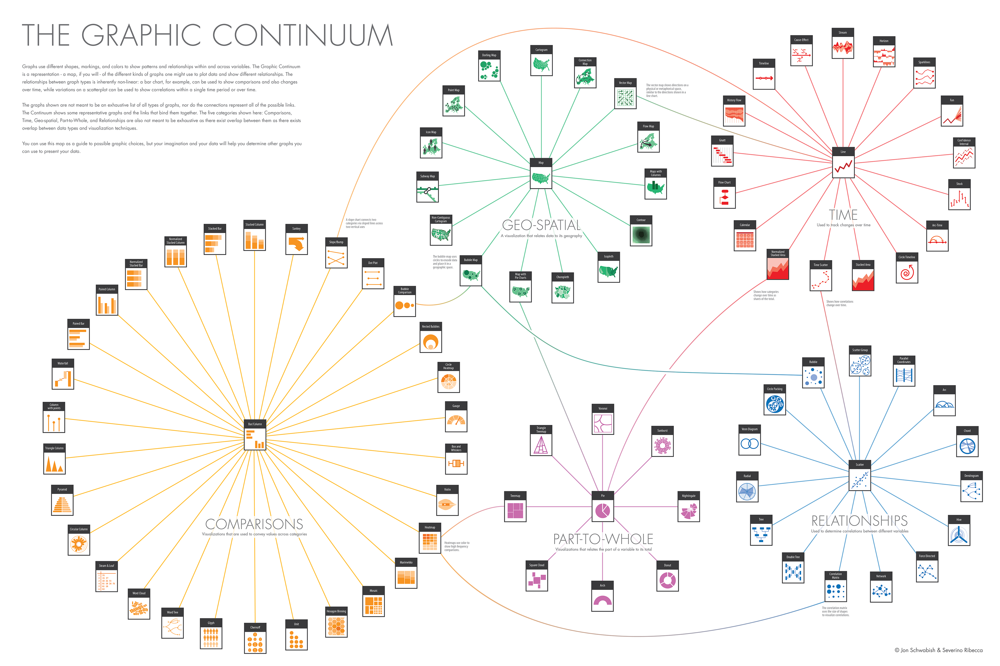

---
output:
  pdf_document: default
  html_document: default
---

# Visualizações de dados (ggplot2) {#ggplot2}

```{r 12-ggplot2-1, include=FALSE, warning=FALSE, message=FALSE}
knitr::opts_chunk$set(fig.align='center', fig.width = 7, fig.asp = 0.618,
                      out.width = '100%')
```

Pacotes deste capítulo:

```{r 12-ggplot2-2, message = FALSE, warning = FALSE}
library(readxl)
library(tidyverse)
library(ISLR)
library(RColorBrewer)
library(ggthemes)
library(hrbrthemes)
library(treemapify)
library(gapminder)
library(sf)
library(geobr)
library(readxl)
library(janitor)
# novos:
library(ggrepel)
library(countrycode)
library(patchwork)
library(wpp2019)
library(rbcb) # remotes::install_github('wilsonfreitas/rbcb')

```


O `ggplot2` é mais um pacote desenvolvido por Hadley Wickham, o criador, por exemplo, do `tidyr` e do `dplyr`. A ideia do pacote, ainda que com algumas modificações, vem de uma obra chamada [_The Grammar of Graphics_](https://www.amazon.com/Grammar-Graphics-Statistics-Computing/dp/0387245448), que é uma maneira de descrever um gráfico a partir dos seus componentes. Dessa forma, teoricamente, ficaria mais fácil entender a construção de gráficos mais complexos. 

Esse pacote é estruturado de forma que a "gramática" seja utilizada para um gráfico a partir de múltiplas camadas. As camadas serão formadas por dados, mapeamentos estéticos, transformações estatísticas dos dados, objetos geométricos (pontos, linhas, barras etc.) e ajuste de posicionamento. Além disso, existem outros componentes, como os sistemas de coordenadas (cartesiano, polar, mapa etc.) e, se for o caso, divisões do gráfico em subplots (_facet_). Um simples exemplo de múltiplas camadas seria um gráfico de pontos adicionado de uma curva de ajustamento.

Uma forma geral (template) para entender-se a estrutura do ggplot2, segundo o próprio Hadley Wickhan, no livro [R for Data Science](http://r4ds.had.co.nz/data-visualisation.html#the-layered-grammar-of-graphics), é a seguinte:

```
ggplot(data = <DATA>) + 
  <GEOM_FUNCTION>(
     mapping = aes(<MAPPINGS>),
     stat = <STAT>, 
     position = <POSITION>
  ) +
  <COORDINATE_FUNCTION> +
  <FACET_FUNCTION> # dividir o gráfico em subplots
```

A ideia é que todo gráfico pode ser representado por essa forma. No entanto, na criação de um gráfico, não é necessário especificar-se todas as partes acima. O ggplot2 já oferece um padrão para o sistema de coordenadas, para o `stat` e `position`. O `facet` (subplot) só será utilizado quando necessário.

Além disso, existem as escalas que são utilizadas para controlar o mapeamento dos dados em relação aos atributos estéticos do gráfico. Por exemplo: suponha que no seu gráfico exista uma coluna que é uma variável categórica com três classes possíveis e as cores do objeto geométrico estejam associadas a essa variável. Automaticamente, o ggplot2 definirá uma cor pra cada classe. No entanto, você pode alterar a escala de cores para ter controle sobre elas. O mesmo vale para os valores apresentados nos eixos x e y.

Uma observação importante é que apesar dos dados estarem na função `ggplot()` (`<DATA>`), eles também podem ser incluídos diretamente em cada objeto geométrico. Isto será útil quando for necessário criar-se uma nova camada a partir de dados diferentes daqueles que estão inicialmente nos gráficos.

Dessa forma, incorporando essas observações, um template estendido seria o abaixo:

```
ggplot(data = <DATA>) + 
  <GEOM_FUNCTION>(
     mapping = aes(<MAPPINGS>),
     stat = <STAT>, 
     position = <POSITION>,
     data = <DATA> # pode receber os dados diretamente
  ) +
  <SCALE_FUNCTION> + # uma para cada elemento estético
  <COORDINATE_FUNCTION> +
  <FACET_FUNCTION> # dividir o gráfico em subplots
```

Também é importante ressaltar-se que, como todo sistema de gráficos, é possível alterar-se todos os títulos e rótulos do gráfico, além do controle sobre as características do tema do gráfico (cor do fundo, estilo da fonte, tamanho da fonte etc).


## Dataset do módulo

Para este módulo, usaremos o dataset **World Happiness Report**, ou o Relatório Mundial da Felicidade, que é uma medição da felicidade publicado pela Rede de Soluções para o Desenvolvimento Sustentável da ONU (SDSN, na sigla em inglês). Leia o [artigo na Wikipedia](https://pt.wikipedia.org/wiki/Relat%C3%B3rio_Mundial_da_Felicidade) para mais informações.

```{r 12-ggplot2-3, eval = FALSE}
# baixe o arquivo do endereco:
download.file("https://s3.amazonaws.com/happiness-report/2018/WHR2018Chapter2OnlineData.xls",
              destfile = "felicidade.xls")
```


```{r 12-ggplot2-4}
# importar a planilha
df_feliz <- read_excel("felicidade.xls", sheet = 1)
# limpar o nome das colunas
df_feliz <- janitor::clean_names(df_feliz)
# renomear algumas colunas
df_feliz <- df_feliz %>% 
  rename(life_expec = healthy_life_expectancy_at_birth)
# olhar dados 
glimpse(df_feliz)
```

Sentiram falta de uma coluna com o nome do continente?  Vamos também importar um dataset que contém o continente de cada país, fornecido pelo pacote `countrycode`.

```{r 12-ggplot2-5}
# consertar manualmente os nomes de certos paises

df_feliz$country[df_feliz$country == "Bosnia and Herzegovina"] <- "Bosnia & Herzegovina"
df_feliz$country[df_feliz$country == "Czech Republic"] <- "Czechia"
df_feliz$country[df_feliz$country == "Hong Kong S.A.R. of China"] <- "Czechia"
df_feliz$country[df_feliz$country == "Taiwan Province of China"] <- "Taiwan"


# consulte a documentação do dataset
# ?countrycode::codelist 
df_continente <- countrycode::codelist  %>% 
  # selecionar colunas importantes
  select(country = country.name.en, continent, country_code = iso3n) %>% 
  # filtrar fora os paises sem continentes
  filter(!is.na(continent))

# criar dataframe com juncao dos dois
df_feliz <- inner_join(df_feliz, df_continente, by = "country")


# coletar dados de populacao a partir de outro dataset, do pacote wpp2019
data(pop)
df_populacao <- pop %>% 
  select(country_code, `2020`) %>% 
  rename(populacao_2020 = 2)

df_feliz <- df_feliz %>% 
  left_join(df_populacao, by = 'country_code')

# criar dataset apenas para o ano mais recente
df_2017 <- df_feliz %>% 
  filter(year == max(year))

```


Para quebrar-se a barreira inicial, vamos criar um exemplo por partes de um gráfico do PIB per capita e da expectativa de vida dos países em 2017:

```{r 12-ggplot2-6, fig.align='center'}
# Inicia o plot
g <- ggplot(df_2017)

# Adicionar pontos (geom_point) e
# vamos mapear variáveis a elementos estéticos dos pontos
# Size = 3 define o tamanho de todos os pontos
g <- g +
  geom_point(aes(x = log_gdp_per_capita,
                 y = life_expec,
                 color = continent),
             size = 3)

# Rótulos (títulos)
g <- g +
  labs(title = 'Relação entre PIB per capita e expectativa de vida',
       y = 'Anos',
       x = 'USD/pessoa')

g
  
```


Detalharemos cada parte do gráfico, mas vale falar-se rapidamente sobre o código acima. Primeiramente, passamos um conjunto de dados para o ggplot. Depois, adicionamos uma camada de pontos, mapeando as variáveis `log_gdp_per_capita` e `life_expec` para as posições de cada ponto nos eixos `x` e `y`, respectivamente, e a variável `continent` para a cor de cada ponto. Em seguida, alteramos a escala de cor, definindo seu título, os rótulos (`labels`) e os valores (`values`) para as cores. Por fim, definimos os títulos/rótulos do gráfico.

Nas próximas seções, falaremos com mais detalhes sobre cada componente, começando pelo mapeamento estético.

## Mapeamento Estético

O mapeamento estético é o mapeamento das variáveis dos dados para as características visuais dos objetos geométricos (pontos, barras, linhas etc.). Isto é feito a partir da função `aes()`. E quais são as características visuais de um objeto geométrico? Abaixo segue uma lista não exaustiva:

- Posição (`x` e `y`);
- Cor (`color`);
- Tamanho (`size`);
- Preenchimento (`fill`);
- Transparência (`alpha`);
- Texto (`label`).

Como vimos no exemplo acima, mapeamos três variáveis para três características visuais de cada ponto: posição `x`, posição `y` e cor. Nos próximos exemplos, outros elementos estéticos serão utilizados, conforme o objeto geométrico selecionado.

## Objetos geométricos e tipos de gráficos

Os objetos geométricos começam com a expressão `geom_` e são seguidos pelo tipo de objeto. Por exemplo, `geom_point()` para pontos  e `geom_bar()` para barras. A tabela abaixo apresenta os tipos de objetos geométricos utilizados para criar-se alguns tipos de gráficos populares.

Tipo | Objeto Geométrico
:-----:+:-----------------:
Dispersão (scatterplot) | `geom_point()`
Gráfico de bolhas | `geom_point()`
Gráfico de barras | `geom_col()` e `geom_bar()`
Histograma | `geom_histogram()`
Boxplot | `geom_boxplot()`
Densidade | `geom_density()`
Gráfico de linhas | `geom_line()`

Nesse material, os principais tipos de objetos geométricos serão demonstrados a partir de exemplos. A lista completa de objetos geométricos e as descrições dos argumentos estão na [documentação](http://ggplot2.tidyverse.org/) do `ggplot2`.

É importante saber-se que um gráfico do ggplot2 pode ter mais de um objeto geométrico, cada um formando uma camada. Por exemplo, uma camada de pontos e outra de linhas que conectam os pontos.

Vamos, primeiramente, criar um gráfico com pontos:

```{r 12-ggplot2-7, fig.align='center', warning=FALSE, message=FALSE}

ggplot(df_2017, aes(x = log_gdp_per_capita,
                 y = life_expec)) +
  geom_point()

```

Note que o `aes()` está sendo usado diretamente na função `ggplot()` e não no objeto geométrico. O que isto significa? Que o mapeamento estético definido na função `ggplot()` é global. Ou seja, é aplicado para todos os objetos geométricos daquele gráfico, a menos que seja explicitado novamente em alguma camada.

Para finalizarmos essa breve introdução a objetos geométricos, adicionemos mais uma camada ao gráfico:

```{r 12-ggplot2-8, warning=FALSE, message=FALSE, fig.align='center'}

ggplot(df_2017, aes(x = log_gdp_per_capita,
                 y = life_expec)) +
  geom_point() +
  geom_smooth(method = "lm")

```

No exemplo acima, também não foi necessário definir os mapeamentos estéticos da camada `geom_smooth()`, pois eles foram herdados das definições da camada principal, a `ggplot()`. O que aconteceria, no entanto, caso fosse desejado pintar as cores de cada ponto de acordo com alguma variável, como o continente do país?

```{r 12-ggplot2-9, message = FALSE, warning = FALSE}
ggplot(df_2017, aes(x = log_gdp_per_capita,
                 y = life_expec,
                 color = continent)) +
  geom_point() +
  geom_smooth(method = "lm")
```

Note que a camada `geom_smooth()` herdou o mapeamento `color`, de forma que foi criada uma reta de ajuste para cada continente. Isso pode até ser desejável, mas e se o objetivo for destacar a cor apenas dos pontos, mantendo apenas uma reta de ajuste para todos os continentes? 

Seria necessário então alterar o atributor `color` apenas da camada alvo.

```{r 12-ggplot2-10, message = FALSE, warning = FALSE}
ggplot(df_2017, aes(x = log_gdp_per_capita,
                 y = life_expec)) +
  geom_point(aes(color = continent)) +
  geom_smooth(method = "lm")
```

### Escolhendo o tipo de gráfico

Antes de decidir qual gráfico você utilizará, é preciso saber o que se deseja representar. O objetivo guiará o tipo de gráfico mais adequado. A imagem abaixo apresenta uma lista bastante completa de possibilidades de gráficos, dos mais simples aos mais complexos:



Entre [neste link](https://camo.githubusercontent.com/ea2e9eda9b01fafc1213f5c400aa357584f40df8/687474703a2f2f626c6f672e76697375616c2e6c792f77702d636f6e74656e742f75706c6f6164732f323031342f30392f696d6167652d362e706e67) para visualizar a imagem com zoom.


### Gráfico de Dispersão (`geom_point()`)

```{r 12-ggplot2-11, eval = FALSE}
geom_point(mapping = NULL, data = NULL, stat = "identity", position = "identity",
           ..., na.rm = FALSE, show.legend = NA, inherit.aes = TRUE)
```

O gráfico de dispersão é bastante usado para verificar-se relações entre duas variáveis quantitativas. 

Como queremos um gráfico de pontos, o objeto geométrico natural é o `geom_point()`. Esse objeto geométrico tem os seguintes elementos estéticos:

Os parâmetros estéticos (aes) são:

* **`x`**
* **`y`**
* `alpha`
* `colour`
* `fill`
* `shape`
* `size`
* `stroke` 

```{r 12-ggplot2-12}

ggplot(df_2017, aes(x = log_gdp_per_capita, 
                    y = life_expec)) +
  geom_point()

```


Vamos mapear a variável `continent` ao elemento estético color e shape:

```{r 12-ggplot2-13}
ggplot(df_2017, aes(x = log_gdp_per_capita, 
                    y = life_expec)) +
  geom_point(aes(color = continent,
                 shape = continent))
```

Automaticamente o ggplot2 criou uma escala para as cores e formatos dos pontos. O usuário pode alterar este mapeamento utilizando as funções `scale_*_*`.

Por fim, fica aqui a lista com os tipos de shapes:

```{r 12-ggplot2-14, echo = FALSE}
d=data.frame(p=c(0:25,32:127))
ggplot() +
scale_y_continuous(name="") +
scale_x_continuous(name="") +
scale_shape_identity() +
geom_point(data=d, mapping=aes(x=p%%16, y=p%/%16, shape=p), size=5, fill="red") +
geom_text(data=d, mapping=aes(x=p%%16, y=p%/%16+0.25, label=p), size=3, vjust = 0)
```

Perceba que os formatos de 21 a 24 possuem preenchimento (`fill`). Assim, no código abaixo definiremos o preenchimento, o tamanho do ponto e a espessura para aqueles formatos que possuem contornos.

```{r 12-ggplot2-15}

ggplot(df_2017, aes(x = log_gdp_per_capita, 
                    y = life_expec)) +
  geom_point(aes(color = continent,
                 shape = continent,
                 fill = continent)) +
  #scale_color_discrete("Continente") +
  scale_shape_manual("Continente", values = c(19, 21, 22, 23, 24)) +
  labs(title = "Relação entre Renda per Capita e Expectativa de Vida - 2007",
       x = "Renda per Capita (escala log 10)",
       y = "Expectativa de Vida")
```

### Gráficos de Bolhas

O gráfico de bolha é uma extensão natural do gráfico de pontos. Ele permite observar-se possíveis relações entre as três variáveis. Para este tipo de gráfico, são necessárias três variáveis: duas para indicarem as posições x e y e uma terceira para definir o tamanho do ponto (`size`). Vamos utilizar a variável `populacao_2020` (população):

```{r 12-ggplot2-16}
glimpse(df_2017)
```


```{r 12-ggplot2-17}
df_2017 %>% 
  ggplot(aes(x = log_gdp_per_capita,
             y = life_expec, 
             size = populacao_2020)) +
  geom_point() + 
  labs(title = "Relação entre Renda per Capita e Expectativa de Vida - 2007",
       x = "Renda per Capita (escala log 10)",
       y = "Expectativa de Vida")
```

### Gráficos de Barras

Os gráficos de barras/colunas são geralmente utilizados para comparações entre categorias (variáveis qualitativas). No ggplot2 podemos usar dois objetos geométricos distintos:

```{r 12-ggplot2-18, eval = FALSE}
geom_col(mapping = NULL, data = NULL, position = "stack", ...,
  width = NULL, na.rm = FALSE, show.legend = NA, inherit.aes = TRUE)
```

Os parâmetros estéticos (aes) são:

* **`x`**  
* **`y`**  
* `alpha`
* `colour`
* `fill`
* `linetype`
* `size`

No exemplo do dataset, um gráfico de barras é uma boa opção para calcular a população total por continente:


```{r 12-ggplot2-19}

df_feliz %>% 
  group_by(continent) %>% 
  summarise(pop_total = sum(populacao_2020)) %>% 
  ggplot(aes(x = continent, y = pop_total)) +
  geom_col()
  
```


Uma pergunta recorrente é: Como ordenar as barras em ordem crescente/decrescente? Para isso, pode-se utilizar a função `fct_reorder()` no momento do mapeamento. Fica mais claro com um exemplo:

```{r 12-ggplot2-20}


df_feliz %>% 
  group_by(continent) %>% 
  summarise(pop_total = sum(populacao_2020)) %>% 
  ggplot(aes(x = fct_reorder(continent, pop_total),
             y = pop_total)) +
  geom_col()


```

Vamos, agora, criar um gráfico em que se compara a expectativa de vida média por continente em no menor e no maior ano da série temporal:

```{r 12-ggplot2-21}
df_feliz %>% 
  filter(year %in% c(2010, 2017)) %>% 
  # Converte o ano para factor - será categoria no gráfico
  mutate(year = as.character(year)) %>% 
  group_by(continent, year) %>% 
  summarise(life_expec_media = mean(life_expec)) %>% 
  ggplot(aes(x = continent, y = life_expec_media, fill = year)) +
  geom_col()
```

Para continente, o gráfico empilhou as barras. Isto se deve ao argumento `position = stack`. Para colocar as barras lado a lado, utilizamos o valor "dodge":

```{r 12-ggplot2-22}
df_feliz %>% 
  filter(year %in% c(2010, 2017)) %>% 
  # Converte o ano para factor - será categoria no gráfico
  mutate(year = as.character(year)) %>% 
  group_by(continent, year) %>% 
  summarise(life_expec_media = mean(life_expec)) %>% 
  ggplot(aes(x = continent, y = life_expec_media, fill = year)) +
  geom_col(position = "dodge")

```


### Gráficos de linhas

Os gráficos de linhas são, geralmente, utilizados para apresentar-se a evolução de uma variável quantitativa em um intervalo de tempo.

```{r 12-ggplot2-23, eval=FALSE}
geom_line(mapping = NULL, data = NULL, stat = "identity", position = "identity",
          na.rm = FALSE, show.legend = NA, inherit.aes = TRUE, ...)
```

Os parâmetros estéticos (aes) são:

* **`x`**
* **`y`**
* `alpha`
* `colour`
* `linetype`
* `size`


Série temporal é definida como uma variável contínua mensurada em intervalos regulares de tempo. A melhor representação visual para dados desse tipo são gráficos de linha, que são úteis para mostrar o comportamento de uma variável ao longo do tempo.

Como exemplo para gráficos de linha, vamos plotar a evolução de dois importantes indicadores econômicos brasileiros: a taxa SELIC e o índice IPCA, ambos mensalizados. Para obter esses indicadores, usamos o pacote `rbcb`:


```{r 12-ggplot2-24, cache = TRUE}
# Importar para o R dados das series.
lista_datasets <- rbcb::get_series(code = c(ipca = 433, selic = 4390))
# O objeto retornado é uma lista de dois dataframes:
str(lista_datasets)
# Voce pode acessar cada dataframe usando a sintaxe NOME_DA_LISTA$NOME_DO_OBJETO:
str(lista_datasets$selic)
# Vamos então criar apenas um dataset que corresponde a junção dos dois dataframes
df_st <- left_join(lista_datasets$ipca,
                   lista_datasets$selic,
                   by = "date")

# conferindo o novo dataframe criado
head(df_st)

```

Temos uma coluna de data (`date`), cuja classe é `Date` e será usada como eixo x no gráfico de séries temporais:

```{r 12-ggplot2-25}
# grafico do ipca
ggplot(df_st, aes(x = date, y = ipca)) +
  geom_line()

```

Adicionar `geom_smooth(method = "loess")` ajuda a distinguir movimentos de tendência na série temporal:  

```{r 12-ggplot2-26}
df_st %>% 
  filter(date >= as.Date("2008-01-01")) %>% 
  ggplot(aes(x = date, y = selic)) +
  geom_line() +
  geom_smooth(method = "loess", se = FALSE)

```


É possível incluir no gráfico mais de uma variável no eixo y. Uma das alternativas é simplesmente acrescentar mais uma camada `geom_line()` com a nova variável:

```{r 12-ggplot2-27}
ggplot(df_st, aes(x = date, y = ipca)) +
  geom_line() +
  # adicionar mais uma camada de geom_line
  geom_line(aes(y = selic), color = "blue")

```

No entanto, a melhor maneira de se fazer isso é converter os dados para o formato long (tidy):

```{r 12-ggplot2-28}
df_st_tidy <- df_st %>% 
  gather(indicador, valor, ipca:selic) %>% 
  arrange(date)

head(df_st_tidy)
# antes de proceder com o restante do exercicio, vamos salvar o dataset para
# o usar nos proximos modulos
write_rds(df_st_tidy, "series_ipca_selic.rds")
```

Note que `indicador` é uma coluna categórica e `valor`, numérica. Portanto, a primeira será mapeada à *aesthetic* **y** e a segunda a **color**.
Agora, a variável `indicador` é mapeada ao atributo color.

```{r 12-ggplot2-29}
df_st_tidy %>% 
  ggplot(aes(x = date, y = valor, color = indicador)) +
  geom_line()
```

Notou como o período antes de 1995 representava uma realidade muito diferente da atual? Vamos então filtrar os dados a partir desse ano.

```{r 12-ggplot2-30}
df_st_pos_1995 <- df_st_tidy %>% 
  filter(date >= as.Date("1995-01-01"))

df_st_pos_1995 %>% 
  ggplot(aes(x = date, y = valor, color = indicador)) +
  geom_line()
```


### Histogramas

```{r 12-ggplot2-31, eval=FALSE}

geom_histogram(mapping = NULL, data = NULL, stat = "bin",
  position = "stack", ..., binwidth = NULL, bins = NULL, na.rm = FALSE,
  show.legend = NA, inherit.aes = TRUE)

```


Os histogramas são utilizados para representar-se a distribuição de dados de uma variável quantitativa em intervalos contínuos. Esses intervalos são chamados de `bins`. Para cada bin, será apresentada a quantidade de valores que estão naquele intervalo. 

```{r 12-ggplot2-32}

df_2017 %>% 
  ggplot(aes(x = life_expec)) +
  geom_histogram()


```


A função `geom_histogram()`, por padrão, "quebra" a variável em 30 intervalos. É possível mudar esse comportamento especificando o argumento `bins`:

```{r 12-ggplot2-33}
# reduzindo o numero de intervalos
df_feliz %>% 
  ggplot(aes(x = life_expec)) +
  geom_histogram(bins = 10)
```


```{r 12-ggplot2-34}
# aumentando o número de intervalos
df_feliz %>% 
  ggplot(aes(x = life_expec)) +
  geom_histogram(bins = 40)
```


Outra maneira de redefinir os intervalos de um histograma é mudando o argumento `binwidth`, que controla a largura dos intervalos. Não é possível definir os argumentos `bins` e `binwidth` de uma só vez; ou um ou o outro.

```{r 12-ggplot2-35}
df_feliz %>% 
  ggplot(aes(x = life_expec)) +
  geom_histogram(binwidth = 5)
```

No histograma acima, ao definir a largura dos intervalos como 5, o histograma criou intervalos usando como centros os números 45, 50, 55, etc. Portanto, os intervalos são [42,5 - 47,5), [47,5 - 52,5), etc.

É possível també definir os limites dos intervalos. Por exemplo, caso você deseje que os intervalos comecem com números que terminem em 5, deve-se alterar o argumento `boundary`:


```{r 12-ggplot2-36}
df_feliz %>% 
  ggplot(aes(x = life_expec)) +
  geom_histogram(binwidth = 5, boundary = 5)

```

Assim, conseguimos criar uma visualização que mostra que a grande maioria dos países possui uma expectativa de vida maior que 60 anos, e que alguns poucos países possuem uma expectativa de vida menor que 50 anos e maior que 75.

Como você já deve ter imaginado, é possível mudar aspectos visuais do histograma alterando suas *aesthetics*, como mudar a cor do histograma por valores atributos ou mapear alguma variável à cor do histograma. Veja que a cor de um histograma é definida pela propriedade `fill`, pois `color` altera apenas a cor das bordas das barras:

```{r 12-ggplot2-37}
df_feliz %>% 
  ggplot(aes(x = life_expec)) +
  geom_histogram(binwidth = 5, boundary = 5,
                 color = "red", fill = "green", alpha = 0.5)
```

```{r 12-ggplot2-38}
df_feliz %>% 
  ggplot(aes(x = life_expec)) +
  geom_histogram(binwidth = 5, boundary = 5, aes(fill = continent))
```


### Boxplots e violinplots

O boxplot é uma representação comum para apresentar-se a distribuição de uma variável a partir de seus quantis. A imagem abaixo detalha como um boxplot é formado.


O boxplot também pode ser usado para verificar-se a distribuição de variável para um conjunto de valores de uma segunda variável. Por exemplo: qual é a distribuição da expectativa de vida por ano?

```{r 12-ggplot2-39}

ggplot(df_2017, aes(x = continent,
                     y = life_expec)) +
  geom_boxplot()

```

Vemos que existe um possível outlier em 1992. Quando falarmos sobre anotações, voltaremos a este gráfico.

Para termos uma visão da distribuição geral dos valores por ano, podemos utilizar o `geom_violin()`. O violinplot baseia-se na densidade de probabilidade de uma variável contínua. Assim, é possível verificar-se em quais intervalos existe uma maior chance de ocorrência. Isto é representado pela parte mais larga do objeto.

```{r 12-ggplot2-40}


ggplot(df_2017, aes(x = continent,
                     y = life_expec)) +
  geom_violin()

```

### Textos/Rótulos

As funções `geom_text()` e `geom_label()` servem para acrescentar camadas de texto no gráfico. A única diferença entre as duas é que `geom_label()` desenha um retângulo no fundo do texto, possivelmente melhorando sua leitura. Ambas funções `geom_text()` dependem de três *aesthetics*: **x** e **y**, que correspondem às posições dos textos a serem plotados, e **label**, que é o texto a ser plotado.

No exemplo abaixo, não especificamos **x** e **y** em `geom_text()` porque a função herda as definidas na função `ggplot()`:


```{r 12-ggplot2-41, eval=FALSE}
geom_label(mapping = NULL, data = NULL, stat = "identity", position = "identity",
           ..., parse = FALSE, nudge_x = 0, nudge_y = 0,
           label.padding = unit(0.25, "lines"), label.r = unit(0.15, "lines"),
           label.size = 0.25, na.rm = FALSE, show.legend = NA, inherit.aes = TRUE)

geom_text(mapping = NULL, data = NULL, stat = "identity", position = "identity",
          ..., parse = FALSE, nudge_x = 0, nudge_y = 0, check_overlap = FALSE,
          na.rm = FALSE, show.legend = NA, inherit.aes = TRUE)
```

Os parâmetros estéticos (`aes`) são:

* **`label`**
* **`x`**
* **`y`**
* `alpha`
* `angle`
* `colour`
* `family`
* `fontface`
* `hjust`
* `lineheight`
* `size`
* `vjust`

Para adicionar textos ou rótulos, utilizamos, respectivamente, o `geom_text()` e o `geom_label()`, que se diferenciam na formatação. Isto ficará mais claro nos exemplos a seguir:

```{r 12-ggplot2-42}

df_2017 %>% 
  group_by(continent) %>% 
  summarise(life_expec_media = round(mean(life_expec))) %>% 
  ggplot(aes(x = continent, y = life_expec_media)) +
  geom_col() +
  geom_text(aes(label = life_expec_media), 
            vjust = 2)

```


```{r 12-ggplot2-43}

df_2017 %>% 
  group_by(continent) %>% 
  summarise(life_expec_media = round(mean(life_expec))) %>% 
  ggplot(aes(x = continent, y = life_expec_media)) +
  geom_col() +
  geom_label(aes(label = life_expec_media), 
            vjust = 2)

```


Suponha que no primeiro gráfico de pontos mostrado no material, que mostra a relação entre PIB per capita e expectativa de vida, você deseja também acrescentar os nomes dos países:


```{r 12-ggplot2-44}

df_2017 %>% 
  ggplot(aes(x = log_gdp_per_capita,
             y = life_expec)) +
  geom_point() +
  geom_text(aes(label = country))

```

Como era de se esperar, o gráfico ficou muito poluído. Vamos então reduzir os pontos que queremos mostrar os nomes dos respectivos países apenas aos países dos continentes americanos. A estrategia, então, consiste em criar um novo dataframe com esses países e mudar o argumento `data` em geom_text:

```{r 12-ggplot2-45}
america <- df_2017 %>% 
  filter(continent == "Americas")

df_2017 %>% 
  ggplot(aes(x = log_gdp_per_capita,
             y = life_expec)) +
  geom_point() +
  geom_text(data = america, aes(label = country))


```

Melhorou, mas ainda assim ficou poluído. Uma boa solução para esse problema é o pacote `ggrepel`, que internamente calcula a melhor posição entre os pontos da camada de texto, seja `geom_text()` ou `geom_label()`, de forma que não haja conflito de posição entre pontos. A única alteração necessária é mudar `geom_text` para `geom_text_repel`:

```{r 12-ggplot2-46}

df_2017 %>% 
  ggplot(aes(x = log_gdp_per_capita,
             y = life_expec)) +
  geom_point() +
  geom_text_repel(data = america, aes(label = country))

```


### Anotações

Para criarmos anotações no ggplot2, podemos utilizar a função `annotate()`.

Primeiro, vamos manipular os dados para saber qual é aquele ponto:

```{r 12-ggplot2-47}

ggplot(df_2017, aes(x = continent,
                     y = life_expec)) +
  geom_boxplot()

```


```{r 12-ggplot2-48}

df_2017 %>% filter(continent == "Americas", life_expec < 60)

```

Com essas informações, podemos adicionar uma anotação ao gráfico:

```{r 12-ggplot2-49}

ggplot(df_2017, aes(x = continent,
                     y = life_expec)) +
  geom_boxplot() +
  annotate("text", x = "Americas", y = 52, label = "Haiti") 
```

Também podemos adicionar segmentos e retângulos com o `annotate()`. Vamos marcar o período de 1982 a 2002 com um retângulo:


```{r 12-ggplot2-50}

df_feliz %>% 
  filter(country == "Brazil") %>% 
  ggplot(aes(x = year, y = log_gdp_per_capita)) +
  geom_line() +
  geom_point() +
  annotate("rect",
           xmin = 2010, xmax = 2014,
           ymin = -Inf, ymax = Inf, 
           alpha = 0.2)
  

```


### Cleveland Dot Plot

O cleveland dot plot é uma visualização que pode substituir os gráficos de barras. A ideia é que o gráfico fica menos poluído com os pontos, fazendo com que o leitor foque no que é importante. Vamos criar um gráfico para comparar as expectativas de vida no ano de 2007 para os países das Américas:

```{r 12-ggplot2-51}

df_2017 %>% 
  filter(continent == "Americas") %>% 
  ggplot(aes(x = life_expec, y = reorder(country, life_expec))) +
   geom_point(size = 3, color = "dodgerblue") 

```

Esse tipo de gráfico também pode apresentar mais de um ponto para cada valor da variável categórica (país):

```{r 12-ggplot2-52}

df_feliz %>% 
  filter(year %in% c(2010, 2017),
         continent == "Americas") %>% 
  ggplot(aes(x = log_gdp_per_capita, y = country, color = factor(year))) +
  geom_point(aes(color = factor(year)))

```

No gráfico acima, vemos dois pontos para cada país, um para representar 1987 e outro para 2007.

Para completarmos o gráfico, precisamos adicionar uma linha conectando esses dois pontos. Esse gráfico é chamado de _connected dot plot_. Um detalhe importante é que queremos criar uma linha por país, assim, usaremos o elemento estético `group` para obter o resultado esperado:

```{r 12-ggplot2-53}
gapminder %>% 
  filter(year %in% c(1987, 2007),
         continent == "Americas") %>% 
  ggplot(aes(x = lifeExp, y = country)) +
  geom_line(aes(group = country)) +
  geom_point(aes(color = factor(year))) + 
  labs(title = "Expectativa de vida por país - 1987 e 2007",
       y = "País",
       x = "Anos",
       color = "Ano") +
  theme_ipsum(plot_title_size = 12,   
              axis_title_size = 10) +
  theme(panel.grid.major.y = element_line(linetype = "dashed"))
```

Para finalizar, vamos ordenar o eixo `y` pela expectativa de vida:

```{r 12-ggplot2-54}
gapminder %>% 
  filter(year %in% c(1987, 2007),
         continent == "Americas") %>% 
  ggplot(aes(x = lifeExp, y = reorder(country, lifeExp, max))) +
  geom_line(aes(group = country), color = "grey50") +
  geom_point(aes(color = factor(year))) + 
  labs(title = "Expectativa de vida por país - 1987 e 2007",
       y = "País",
       x = "Anos",
       color = "Ano") +
  theme_ipsum(plot_title_size = 12,
              axis_title_size = 10)  +
  theme(panel.grid.major.y = element_line(linetype = "dashed"))
```


### Mapas de calor

Para representar uma relação um pouco mais complexa, a de duas variáveis categóricas e uma numérica, pode-se usar um mapa de calor.

Suponha que você deseja plotar a correlação entre todos os possíveis pares de correlação das variáveis de um dataset:

```{r 12-ggplot2-55}
# calcular correlacao entre as variaveis numericas do dataset de felicidade
df_feliz_num <- df_2017 %>%
  select(life_ladder, log_gdp_per_capita, social_support,
         life_expec, perceptions_of_corruption) %>%
  # removar NAs
  na.omit()

# criar matriz de correlacao
matriz_correl <- cor(df_feliz_num)
# de uma olhada no objeto criado
# matriz_correl

# transformar para dataframe
matriz_correl <- as.data.frame(matriz_correl) 
# conveter rownames para uma coluna
matriz_correl <- rownames_to_column(matriz_correl, "var1")
# converter dataframe para formato tidy
matriz_correl_tidy <- matriz_correl %>% 
  gather(var2, correlacao, -var1)

head(matriz_correl_tidy)
```

Assim, no dataframe `var1` e `var2`, temos duas variáveis categóricas (os pares de variáveis) e uma numérica (a correlação entre as duas variáveis).

A função do `ggplot2` para criar um mapa de calor é `geom_tile`, que precisa de três *aesthetics*: os eixos **x** e **y**, que são as variáveis categóricas, e **fill**, que será a variável contínua que definirá a cor dos quadrados:

```{r 12-ggplot2-56}
matriz_correl_tidy %>% 
  ggplot(aes(x = var1, y = var2, fill = correlacao)) +
  geom_tile()
```

Devido ao tamanho dos nomes das variáveis, o eixo x ficou difícil de ler. Uma solução é mudar o ângulo dos nomes, isto é, colocá-los na vertical. A função `theme()`, que ainda será mostrada em detalhes neste módulo, possui um argumento para fazer isso:

```{r 12-ggplot2-57}

matriz_correl_tidy %>% 
  ggplot(aes(x = var1, y = var2, fill = correlacao)) +
  geom_tile() +
  theme(axis.text.x = element_text(angle = 90))

```


## Escalas

O controle sobre as escalas do gráfico é fundamental no ajuste de um gráfico. Em geral, o ggplot2, como outros pacotes gráficos, fornece as escalas automaticamente, não sendo necessário o entendimento de como se controlar este componente. No entanto, se o interesse é ter controle sobre todos os aspectos de um gráfico, esse componente é fundamental.

Veja o gráfico abaixo:

```{r 12-ggplot2-58, fig.align='center'}
ggplot(iris, aes(x = Petal.Length, y = Petal.Width, color = Species)) +
  geom_point()
```

Note que a cor está mapeada para a variável `Species`. O `ggplot2`, automaticamente, criou a seguinte escala:

Species           | Cor
:----------------:|:--------------:
setosa            | vermelho
versicolor        | verde
virginica         | azul

Todavia, é comum haver interesse em alterar-se essas cores, ou seja, alterar-se a escala de cor. Como fazer isso no ggplot2? Podemos usar, por exemplo, a função `scale_color_manual()`:

```{r 12-ggplot2-59}
ggplot(iris, aes(x = Petal.Length, y = Petal.Width, color = Species)) +
  geom_point() +
  scale_color_manual(values = c("orange", "black", "red"))
```

Utilizamos a função `scale_color_manual()` em razão da variável `Species` ser categórica. Para o ggplot2, dados categóricos são discretos, e a função citada permite criar-se uma escala discreta customizada. No entanto, essa não é a única função para controlar escala de cor. Existem outras como `scale_color_discrete()`, `scale_color_continuous()`, `scale_color_gradient()` etc. A utilização de cada função depende do tipo de dado que se está associando ao elemento estético `color`. Adiante, entraremos em mais detalhes sobre os tipos de dados.

As funções utilizadas para controlar-se as escalas dos elementos de um gráfico do ggplot2 seguem um padrão. Todas iniciam-se com `scale_`, depois o nome do elemento estético (color, fill, x etc.) e, por fim, o tipo/nome da escala que será aplicada.

Abaixo, continuaremos o exemplo anterior, alterando as escalas dos eixos x e y. Note que as variáveis `Petal.Length` e `Petal.Width` são variáveis numéricas/contínuas. Dessa forma, utilizaremos as funções `scale_x_continuous()` e `scale_y_continuous()`: 

```{r 12-ggplot2-60}
ggplot(iris, aes(x = Petal.Length, y = Petal.Width, color = Species)) +
  geom_point() +
  scale_color_manual(values = c("orange", "black", "red")) +
  scale_x_continuous(name = "Petal Length", breaks = 1:7) + 
  scale_y_continuous(name = "Petal Width", breaks = 0:3, limits = c(0, 3))
```

No gráfico acima, definimos quais seriam os pontos em que rótulos deveriam ser exibidos em cada eixo. Além disso, no eixo y, definimos que os limites seriam 0 e 3.

### Tipos de Variáveis

Para melhor uso das escalas, é preciso saber o tipo de variável que foi mapeado para cada elemento estético. Vamos rapidamente montar essa relação:

Classe  | Exemplo | Tipo no ggplot2
:-------:|:---------:|:------------------:
numeric | seq(0, 1, length.out = 10) | continuous
integer | 1L:10L | continuous ou discrete
character | c("Sim", "Não") | discrete
factor | factor(c("Sim", "Não")) | discrete
date | seq(as.Date("2000/1/1"), by = "month", length.out = 12) | date

Lembre-se que o padrão do ggplot é `scale_`, depois o nome do elemento estético (color, fill, x etc.) e, por fim, o tipo/nome da escala que será aplicada. É importante que o usuário saiba o tipo de dado, pois assim saberá com mais facilidade qual é o tipo de escala que deve ser escolhido.

Vamos, em sequência, entrar em mais detalhes para escalas dos eixos (`x` e `y`) e de cores. Espera-se que a intuição desenvolvida a partir dos exemplos das escalas para esses elementos estéticos seja útil para os demais elementos estéticos.

### Eixos

#### Variáveis Contínuas

```{r 12-ggplot2-61, eval = FALSE}
scale_x_continuous(name = waiver(), breaks = waiver(), minor_breaks = waiver(),
                   labels = waiver(), limits = NULL, expand = waiver(),
                   oob = censor, na.value = NA_real_, trans = "identity")

scale_y_continuous(name = waiver(), breaks = waiver(), minor_breaks = waiver(),
                   labels = waiver(), limits = NULL, expand = waiver(),
                   oob = censor, na.value = NA_real_, trans = "identity")
```

Vamos começar editando os valores dos eixos `x` e `y`. 

```{r 12-ggplot2-62}

df_2017 %>% 
  mutate(populacao_milhoes = populacao_2020 / 1000) %>% 
  ggplot(aes(x = populacao_milhoes,
             y = life_expec)) +
  geom_point() +
  # definindo manualmente a escala do eixo x
  scale_x_continuous(breaks = c(0, 100, 200, 300, 400, 500, 1500)) +
  # definindo os intervalos da escala do eixo y
  scale_y_continuous(breaks = scales::breaks_width(5),
                     minor_breaks = NULL)


```

#### Variáveis discretas

Apesar do _help_ não apresentar todos os argumentos para as escalas discretas, podemos usar quase todos que foram listados para escala contínua.

```{r 12-ggplot2-63, eval = FALSE}
scale_x_discrete(..., expand = waiver(), position = "bottom")

scale_y_discrete(..., expand = waiver(), position = "left")
```

No exemplo abaixo, alteraremos os rótulos para uma escala discreta, que originalmente contém os valores `Yes` e `No`.

```{r 12-ggplot2-64}
df_2017 %>% 
  count(continent, name = "qtd_paises") %>% 
  ggplot(aes(x = continent, 
             y = qtd_paises)) +
  geom_col() +
  scale_x_discrete(labels = c("África", "AMÉRICAS", "Ásia", "Europa", "Oceania"))


```


#### Variáveis de Datas

Quando estamos trabalhando com séries temporais, é comum que datas sejam associadas a algum eixo do gŕafico, geralmente ao eixo `x`. As funções padrão para controle de escalas dos eixos, para variáveis de datas, são as seguintes:

```{r 12-ggplot2-65, eval=FALSE}
scale_x_date(name = waiver(), breaks = waiver(), date_breaks = waiver(),
             labels = waiver(), date_labels = waiver(), minor_breaks = waiver(),
             date_minor_breaks = waiver(), limits = NULL, expand = waiver())

scale_y_date(name = waiver(), breaks = waiver(), date_breaks = waiver(),
             labels = waiver(), date_labels = waiver(), minor_breaks = waiver(),
             date_minor_breaks = waiver(), limits = NULL, expand = waiver())

scale_x_datetime(name = waiver(), breaks = waiver(), date_breaks = waiver(),
                 labels = waiver(), date_labels = waiver(), minor_breaks = waiver(),
                 date_minor_breaks = waiver(), limits = NULL, expand = waiver())

scale_y_datetime(name = waiver(), breaks = waiver(), date_breaks = waiver(),
                 labels = waiver(), date_labels = waiver(), minor_breaks = waiver(),
                 date_minor_breaks = waiver(), limits = NULL, expand = waiver())
```

O `scale_*_date` é utilizado para variáveis do tipo `Date` e `scale_*_datetime` para variáveis do tipo `POSIXct`. A classe `POSIXct` aceita informações relacionadas a tempo/horário e a classe `Date` aceita apenas dia, mês e ano.

O mais importante é a possibilidade de alterar-se o modo como as datas são apresentadas a partir do argumento `date_labels`. Para isso, utilizaremos um exemplo a partir dos dados `economics`. Primeiro, observa-se o resultado padrão do ggplot2:

```{r 12-ggplot2-66}
head(economics)
```


```{r 12-ggplot2-67}
ggplot(economics, aes(x = date, y = unemploy)) +
  geom_line() 
```

Agora, suponha que queremos alterar o gráfico para o formato "Jan/1970":

```{r 12-ggplot2-68}
ggplot(economics, aes(x = date, y = unemploy)) +
  geom_line() +
  scale_x_date(date_labels = "%b/%Y")
```

O `%b/%Y` é usado para definir-se o formato de data desejado. Para ver a lista de formatos, use `help(strptime)`. Para os `breaks`, temos duas opções: utilizar-se o argumento `breaks`, informando um vetor de datas, ou usar-se o argumento `date_breaks`, em que se informa a frequência dos breaks (por exemplo, "1 month" e "5 years"). Veja os exemplos abaixos:

```{r 12-ggplot2-69}
ggplot(economics, aes(x = date, y = unemploy)) +
  geom_line() +
  scale_x_date(date_breaks = "5 years", date_labels = "%Y")
```

```{r 12-ggplot2-70}
seq_datas <- seq.Date(as.Date('1970-01-01'),
                      as.Date('2015-04-01'),
                      by = '5 years')
ggplot(economics, aes(x = date, y = unemploy)) +
  geom_line() +
  scale_x_date(breaks = seq_datas, date_labels = "%Y")
```

### Escalas de Cores (color) e Preenchimento (fill)

Como nos casos dos eixos `x` e `y`, o tipo da variável utilizada define qual o tipo de escala. 

|Tipo da Variável | Escala | Descrição |
------------+----------+----------------------------------------------------------------------
|Discreta  | **hue**       | escolhe n cores igualmente espaçadas em um disco de cores. É possível editar a luminosidade e a saturação. |
|          | grey          | escala de cinza |
|          | brewer        | ver pacote RColorBrewer |
|          | identity      | usa as cores inseridas na própria variável |
|          | manual        | escolhe as cores manualmente |
| Contínua | **gradient**  | cria um gradiente de duas cores (low-high) |
|          | gradient2     | cria um gradiente de cores divergentes (low-mid-high) |
|          | gradientn     | cria um gradiente com n cores

A opção `hue` usa a seguinte roda de cores:

```{r 12-ggplot2-71, echo=FALSE, fig.cap='Roda de Cores - hue'}
library(ggplot2)
r  <- seq(0,1,length=201)
th <- seq(0,2*pi, length=201)
d  <- expand.grid(r=r,th=th)
gg <- with(d,data.frame(d,x=r*sin(th),y=r*cos(th),
                        z=hcl(h=360*th/(2*pi),c=100*r, l=65)))
ggplot(gg) +
  geom_point(aes(x,y, color=z), size=3)+
  scale_color_identity()+labs(x="",y="") +
  coord_fixed()
```

A opção brewer pode usar as paletas de cores disponíveis no pacote RColorBrewer.

```{r 12-ggplot2-72, echo=FALSE}
library(RColorBrewer)
```


```{r 12-ggplot2-73, eval = FALSE}
library(RColorBrewer)
display.brewer.all(n=NULL, type="all", select=NULL, exact.n=TRUE,
                                 colorblindFriendly=FALSE)
```

```{r 12-ggplot2-74, echo=FALSE}
knitr::include_graphics('images/brewer_pal.png')
```

No exemplo abaixo, vamos utilizar a função `brewer.pal`, que retorna um vetor de cores de alguma paleta do pacote RColorBrewer. O objeto `paleta.gradientn` recebe nove cores da paleta `Reds`. Essas cores são utilizadas na função `scale_fill_gradientn()`.

```{r 12-ggplot2-75}

matriz_correl_tidy %>% 
  ggplot(aes(x = var1, y = var2, fill = correlacao)) +
  geom_tile() +
  theme(axis.text.x = element_text(angle = 90)) +
  scale_fill_distiller(palette = "RdYlGn")

```


Alguns pacotes também fornecem escalas de cores próprias, como é o caso do pacote `viridis`.

```{r 12-ggplot2-76}

matriz_correl_tidy %>% 
  ggplot(aes(x = var1, y = var2, fill = correlacao)) +
  geom_tile() +
  theme(axis.text.x = element_text(angle = 90)) +
  viridis::scale_fill_viridis() 
```


## Subplots (facet)

*facets* são um excelente recurso do ggplot2 que permitem segmentar um gráfico em subgráficos de acordo com uma variável categórica.

Existem duas maneiras de definir *facets* no `ggplot2`: `facet_wrap()`, ideal para apenas uma variável, e `facet_grid()` ideal para uma combinação de duas variáveis.

Já vimos como acrescentar a informação do continente em um gráfico de pontos mudando o atributo *color*. Uma alternativa é criar um subgráfico para cada continente por meio de *facets.*


* Painéis em formato de grid:
```{r 12-ggplot2-77, eval=FALSE}
facet_grid(facets, margins = FALSE, scales = "fixed", space = "fixed", shrink = TRUE,
           labeller = "label_value", as.table = TRUE, switch = NULL, drop = TRUE)
```

* Converte painéis de uma dimensão para duas dimensões:

```{r 12-ggplot2-78, eval=FALSE}
facet_wrap(facets, nrow = NULL, ncol = NULL, scales = "fixed", shrink = TRUE,
           labeller = "label_value", as.table = TRUE, switch = NULL, drop = TRUE,
           dir = "h")
```

Antes de mais nada, vamos criar um exemplo para o `facet_wrap()`:

```{r 12-ggplot2-79}

df_2017 %>% 
  ggplot(aes(x = log_gdp_per_capita,
             y = life_expec)) +
  geom_point() +
  facet_wrap(vars(continent))

```


Usamos a sintaxe `vars(coluna)`. Ou seja, indicamos que queremos quebrar os gráficos pela variável `continent`.

O ggplot2 determinou automaticamente o número de colunas e linhas e fixou as escalas dos eixos. No entanto, podemos definir o número de linhas ou colunas a partir dos argumentos `nrow` e `ncol`. Também é possível definir-se que cada gráfico tenha sua escala. No exemplo abaixo, deixaremos a escala do eixo y livre.

```{r 12-ggplot2-80}

df_2017 %>% 
  ggplot(aes(x = log_gdp_per_capita,
             y = life_expec)) +
  geom_point() +
  facet_wrap(vars(continent), scales = "free_y")
```

Caso se deseja utilizar mais de uma variável para criar os *facets*, usa-se a função `facet_grid()`:

```{r 12-ggplot2-81}

df_feliz %>% 
  # filtrar os anos de 2015 a 2017
  filter(between(year, 2015, 2017)) %>% 
  ggplot(aes(x = log_gdp_per_capita,
             y = life_expec)) +
  geom_point() +
  facet_grid(cols = vars(continent), rows =  vars(year))

```

## Temas

O ggplot2 fornece alguns temas prontos. Todavia, o usuário pode alterar manualmente cada detalhe de um gráfico ou criar um tema que será utilizado em outras visualizações. Para editar o tema, será usada a função `theme()`. Nesta função, poderão ser alterados os elementos do tema, como a cor de fundo do painel, o tamanho da fonte do eixo x, a posição da legenda etc. A lista de elementos está disponível [neste link](http://docs.ggplot2.org/current/theme.html).

Para cada elemento do tema, um tipo de objeto é esperado para realizar alterações. Por exemplo, para alterar-se o estilo do título do eixo x (`axis.title.x`) é preciso passar-se a função `element_text()`, que possui diversos parâmetros (família da fonte, tipo da fonte, cor, tamanho, alinhamento etc.). Além do `element_text()`, as principais funções para alterar-se elementos do tema são `element_line()`, `element_rect()` e `element_blank()`. O `element_blank()` é usado a fim de que nada seja desenhado para o elemento que recebe esta função.

Em um primeiro momento, pode parecer complicado alterar o tema via código, porém, conforme o usuário for praticando, essas alterações ficarão mais intuitivas. De toda forma, existe um addin para o RStudio que ajuda a customizar-se um gráfico do ggplot2 a partir de uma interface de _point and click_. Para instalá-lo, faça o seguinte:

```{r 12-ggplot2-82, eval=FALSE}
install.packages('ggThemeAssist')
```

Para exemplificar a alteração do tema manualmente:

```{r 12-ggplot2-83}

ggplot(df_2017, aes(x = log_gdp_per_capita, 
                    y = life_expec)) +
  geom_point() + 
  theme(text = element_text(face = "bold"), 
        panel.grid.major = element_line(colour = "gray80"), 
        axis.title = element_text(size = 14),
        panel.background = element_rect(fill = "gray100"))
```

### Temas disponíveis no ggplot2

```{r 12-ggplot2-84, fig.height=20, eval=FALSE}
p <- ggplot(df_2017, aes(x = log_gdp_per_capita, 
                    y = life_expec)) +
  geom_point()

p + theme_gray() +
  labs(title = "theme_gray()")

p + theme_bw() +
  labs(title = "theme_bw()")

p + theme_linedraw() +
  labs(title = "theme_linedraw()")

p + theme_light() +
  labs(title = "theme_light()")

p + theme_minimal() +
  labs(title = "theme_minimal()")

p + theme_classic() +
  labs(title = "theme_classic()")

p + theme_dark() +
  labs(title = "theme_dark()")

p + theme_void() +
  labs(title = "theme_void()")
```


```{r 12-ggplot2-85, fig.height=30, echo=FALSE, fig.asp = 3}

p <- ggplot(df_2017, aes(x = log_gdp_per_capita, 
                    y = life_expec)) +
  geom_point()

p1 <- p + theme_gray() +
  labs(title = "theme_gray()")

p2 <- p + theme_bw() +
  labs(title = "theme_bw()")

p3 <- p + theme_linedraw() +
  labs(title = "theme_linedraw()")

p4 <- p + theme_light() +
  labs(title = "theme_light()")

p5 <- p + theme_minimal() +
  labs(title = "theme_minimal()")

p6 <- p + theme_classic() +
  labs(title = "theme_classic()")

p7 <- p + theme_dark() +
  labs(title = "theme_dark()")

p8 <- p + theme_void() +
  theme(text = element_text(angle = 0)) +
  labs(title = "theme_void()")

gridExtra::grid.arrange(p1, p2, p3, p4, p5, p6, p7, p8, ncol = 1)
```

### Temas no pacote ggthemes

O pacote [`ggthemes`](https://github.com/jrnold/ggthemes) disponibiliza um conjunto de temas e escalas de cores. Vamos apresentar alguns temas disponíveis:

```{r 12-ggplot2-86, fig.height=30, echo=FALSE, fig.asp = 3}
library(ggthemes)
p1 <- p + theme_base() +
  labs(title = "theme_base()")

p2 <- p + theme_economist() +
  labs(title = "theme_economist()")

p3 <- p + theme_few() +
  labs(title = "theme_few()")

p4 <- p + theme_fivethirtyeight() +
  labs(title = "theme_fivethirtyeight()")

p5 <- p + theme_gdocs() +
  labs(title = "theme_gdocs()")

p6 <- p + theme_hc() +
  labs(title = "theme_hc()")

p7 <- p + theme_tufte() +
  labs(title = "theme_tufte()")

p8 <- p + theme_wsj() +
  labs(title = "theme_wsj()")

gridExtra::grid.arrange(p1, p2, p3, p4, p5, p6, p7, p8, ncol = 1)

```

### hrbrthemes

Alguns pacotes fornecem seus próprios temas. É o caso do `hrbrthemes`. Este pacote fornece um tema bastante interessante e será usado no resto deste capítulo. Como qualquer outro tema, se for necessário, você pode editá-lo com a função `theme()`:

```{r 12-ggplot2-87, eval=FALSE}
install.packages("hrbrthemes")
```

```{r 12-ggplot2-88}
library(hrbrthemes)
p +
  theme_ipsum(plot_title_size = 12,
              axis_title_size = 10)
```

### Setando o tema globalmente

Com o comando abaixo, todos os gráficos do seu script terão o mesmo tema:

```{r 12-ggplot2-89, eval = FALSE}
theme_set(theme_ipsum(plot_title_size = 12,
              axis_title_size = 10) +
          theme(text = element_text(angle = 0)))
```


## Legendas

A melhor maneira de alterar as legendas de um gráfico do ggplot2, dando nomes mais amigáveis, é por meio da função `labs()`.


```{r 12-ggplot2-90}
p + 
  labs(x = "Log da PIB per capita",
       y = "Expectativida de vida em anos",
       title = "Relação entre PIB per capita e expectativida de vida",
       subtitle = "Existe uma correlação positiva entre as duas variáveis",
       # Aqui usamos '\n', um character especial do R, para
       # adicioanar uma quebra de linha 
       color = "Continente\n do país",
       caption = "Autor: Eu")

```


## Mapas: plotando polígonos  

Produzir mapas com o R nunca foi tão fácil como hoje, graças a avanços recentes dos pacotes `sf` e `ggplot2`. Foge muito do escopo deste curso explicar a estrutura de dados espaciais, como shapefiles. Mesmo sem esse entedimento, porém, é possível fazer gráficos com mapas de maneira muito simples.

O pacote [`geobr`](https://github.com/ipeaGIT/geobr), desenvolvido pelo brasileiro Ítalo Cegatta, facilita a importação de arquivos shapefiles brasileiros.  

```{r 12-ggplot2-91, cache = TRUE}
# importar shapefiles de estados brasileiros
geo_ufs <- geobr::read_state(code_state = 'all', year = 2018)
```

```{r 12-ggplot2-92}
head(geo_ufs)
```


Observe que o dataframe possui cinco colunas, sendo a última relacionada às informações espaciais sobre os polígonos dos estados que serão usadas para construir os mapas.

A sintaxe do ggplot2 para construir mapas é relativamente diferente: não é preciso definir nenhuma *aesthetic*, pois a função `geom_sf` internamente busca a coluna de polígonos presente no objeto:

```{r 12-ggplot2-93}

ggplot(geo_ufs) +
  # a linha abaixo da no mesmo que geom_sf(aes(geometry = geom))
  geom_sf()

```

A partir do gráfico base criado acima, as customizações seguem o padrão do ggplot2. Por exemplo, é possível mapear a cor os polígonos de acordo com uma variável presente nos dados, além de alterar aspectos visuais com a função `theme`:

```{r 12-ggplot2-94}
ggplot(geo_ufs) +
  # a linha abaixo da no mesmo que geom_sf(aes(geometry = geometry))
  geom_sf(aes(geometry = geom,
              # colorir os poligonos de acordo com sua regiao
              fill = as.character(code_region))) +
  # deixar o mapa mais limpo e sem eixos
    theme(
    panel.background = element_blank(),
    panel.grid.major = element_line(color = "transparent"),
    axis.text = element_blank(),
    axis.ticks = element_blank()
  ) + 
  # mudar titulo da legenda
  labs(fill = "Região")
```


<div class="alert alert-info"
<strong>Referências:</strong>  
[geom_sf()](https://ggplot2.tidyverse.org/reference/ggsf.html)   
[Tutorial de geom_sf()](https://dcl-2017-01.github.io/curriculum/notes/spatial-vis.html)  
</div>


### Projeto: plotando indicadores socioeconômicos em um mapa.

Neste exemplo, mostramos como o `ggplot2` pode ser usado para produzir mapas muito informativos, mapeando a cor de cada polígono a uma variável numérica, como PIB ou população. 

Observe o passo-a-passo de coleta e transformação dos dados do PIB per capita dos municípios brasileiros:

```{r 12-ggplot2-95 }
# origem do conjunto de dados:
# ftp://ftp.ibge.gov.br/Pib_Municipios/2017/base/base_de_dados_2010_2017_xls.zip
# baixe o arquivo, descompacte, abra no excel ou no libre office e salve como xlsx
# o R não consegue ler arquivos xls
df_pib <- read_excel('dados/base_de_dados_2010_2017_xls/PIB dos Municípios - base de dados 2010-2017.xlsx')
# limpar nomes das colunas
df_pib <- janitor::clean_names(df_pib)
# observe os dados:
glimpse(df_pib)

```


```{r 12-ggplot2-96 }
# agregando dados por estado, calculando o pib por cidade
df_pib_uf <- df_pib %>% 
  # filtrar 2017
  filter(ano == 2017) %>% 
  # filtrar fora DF
  filter(sigla_da_unidade_da_federacao != 'DF') %>% 
  group_by(codigo_da_unidade_da_federacao) %>% 
  summarise(qtd_cidades = n(),
            pib_uf = sum(produto_interno_bruto_a_precos_correntes_r_1_000),
            pib_por_cidade = pib_uf/qtd_cidades)


head(df_pib_uf)
```


Com o dataframe de PIB por cidade criado, podemos o unir com o dataframe que contem os dados espaciais dos estados:

```{r 12-ggplot2-97}

geo_uf_pib <- left_join(geo_ufs, df_pib_uf, by = c('code_state' = 'codigo_da_unidade_da_federacao'))


head(geo_uf_pib)
```

Enfim, podemos proceder com a criação do mapa:

```{r 12-ggplot2-98}

ggplot(geo_uf_pib) +
  geom_sf(aes(fill = log(pib_por_cidade))) +
  # mudar escala de cores para sequencial vermelha
  scale_fill_distiller(type = "seq",
                       palette = "Greens",
                       direction = 1) +
  # deixar o mapa mais limpo e sem eixos
    theme(
      legend.position = "bottom",
      panel.background = element_blank(),
      panel.grid.major = element_line(color = "transparent"),
      axis.text = element_blank(),
      axis.ticks = element_blank()
      ) +
  labs(title = "PIB por cidade",
       fill = NULL)

```


## Salvando Gráficos

Há duas formas de salvar o gráfico gerado pelo ggplot2. A primeira delas é clicando no botão **Export** na aba **Plots**. Lá existirão três opções: exportar para o clipboard, salvar como PDF ou salvar como imagem.

```{r 12-ggplot2-99, eval=FALSE}

```

A outra opção é usar a função `ggsave()`:

```{r 12-ggplot2-100, eval=FALSE}
ggsave(filename, plot = last_plot(), device = NULL, path = NULL,
  scale = 1, width = NA, height = NA, units = c("in", "cm", "mm"),
  dpi = 300, limitsize = TRUE, ...)
```

O argumento `device` é usado para escolher-se o tipo de arquivo ("eps", "ps", "tex" (pictex), "pdf", "jpeg", "tiff", "png", "bmp", "svg" or "wmf").

## Extensões do ggplot2

Um conjunto de pacotes fornece extensões ao ggplot2. Ou seja, cria funcionalidades não existentes no pacote original.

Veja [neste link](http://www.ggplot2-exts.org/gallery/) uma galeria com as extensões. Aqui, exemplificaremos algumas:

### ggrepel

O `ggrepel` é importante para evitar que textos (`geom_text`) e rótulos (`geom_label`) se sobreponham. Veja o mesmo gráfico sem e com o ggrepel:

```{r 12-ggplot2-101}
library(ggrepel)
data(mtcars)
ggplot(mtcars, aes(wt, mpg)) +
  geom_point(color = 'red') +
  geom_text(aes(label = rownames(mtcars))) +
  theme_ipsum(plot_title_size = 12,  
              axis_title_size = 10)
```


```{r 12-ggplot2-102}
library(ggrepel)
data(mtcars)
ggplot(mtcars, aes(wt, mpg)) +
  geom_point(color = 'red') +
  geom_text_repel(aes(label = rownames(mtcars))) +
  theme_ipsum(plot_title_size = 12,  
              axis_title_size = 10)
```

### gganimate

Outra extensão muito interessante é o `gganimate`. Com esta extensão é possível criar gifs (animações) de gráficos do ggplot2. O ponto fundamental é definir-se uma variável que controlará os `frames`, ou seja, as imagens que serão sobrepostas para compor-se a animação.

Veja o exemplo abaixo:

```{r 12-ggplot2-103, eval=FALSE}
# O pacote não está no cran
#devtools::install_github("dgrtwo/gganimate")
library(gganimate)

p <- ggplot(gapminder, aes(x = gdpPercap, y = lifeExp,
                      size = pop, color = continent,
                      frame = year)) +
  geom_point() +
  scale_x_log10()

animation::ani.options(interval = 1)
x <- gganimate(p, filename = 'images/gapminder1.gif',
               ani.width = 750,
               ani.height = 450)
```

```{r 12-ggplot2-104, echo=FALSE, eval=TRUE}
knitr::include_graphics('images/gapminder1.gif')
```

É possível suavizar a animação com o pacote `tweenr`. É um pouco complicado, mas fica o exemplo abaixo retirado [deste post](http://blog.revolutionanalytics.com/2017/05/tweenr.html):

```{r 12-ggplot2-105, eval=FALSE}
library(tweenr)

years <- unique(gapminder$year)
gapminder_list <- list()
for(i in 1:length(years)){
  j <- years[i]
  gapminder_list[[i]] <- gapminder %>% 
    filter(year == j)
}

tf <- tween_states(gapminder_list,
                   tweenlength = 2,
                   statelength = 0,
                   ease = rep("linear", length(gapminder_list)),
                   nframes = 308)

tf2 <- expand.grid(y = 80, x = 10^(2.5), year = seq(1957, 2007, 5))
tf2 <- split(tf2, tf2$year)
tf2 <- tween_states(tf2,
                   tweenlength = 2,
                   statelength = 0,
                   ease = rep("linear", length(tf2)),
                   nframes = 308)
tf2 <- tf2 %>% 
  mutate(year = rep(seq(1957, 2007, 5), each = 29)[1:310])

p2 <- ggplot(tf,
             aes(x=gdpPercap, y=lifeExp, frame = .frame)) +
  geom_point(aes(size=pop, color=continent), alpha=0.8) +
  geom_text(data = tf2, aes(x = x, y = y, label = year)) +
  xlab("GDP per capita") +
  ylab("Life expectancy at birth") +
  scale_x_log10()
animation::ani.options(interval = 1/20)
x <- gganimate(p2, filename = 'images/gapminder2.gif',
               ani.width = 750,
               ani.height = 450,
               title_frame = FALSE)

```

```{r 12-ggplot2-106, echo=FALSE, eval=TRUE}
knitr::include_graphics('images/gapminder2.gif')
```

## Exercícios

### Parte 1

1. Crie um gráfico de dispersão utilizando a base `gapminder` para o ano de 2007. Mapeie uma variável para o tamanho do ponto e adicione os títulos do gráfico e dos eixos.

2. No gráfico anterior, como você faria para que o ponto do Brasil fosse identificado com uma cor adicional? Dica: se uma nova camada usar um segundo conjunto de dados é preciso informar usando o argumento `data`. Exemplo: `geom_point(data = novo_data_frame, ...)`.

3. Crie um histograma da variável `wage` a partir da base de dados `Wage` do pacote `ISLR`. Crie uma visualização da distribuição da variável `wage` por nível da variável education. Mapeie a variável education para o elemento estético `fill`.

```{r 12-ggplot2-107, include=FALSE, eval=FALSE, fig.height=10}
library(ISLR)
library(tidyr)
ggplot(Wage, aes(x = wage)) + 
  geom_histogram() +
  facet_wrap(~ education)

Wage2 <- Wage %>% select(-education)
  
ggplot(Wage, aes(x = logwage, fill = education)) + 
  geom_histogram(data = Wage2, fill = "grey50", alpha = 0.5, 
                 bins = 20) +
  geom_histogram(bins = 20) +
  facet_wrap(~ education, ncol = 2) +
  guides(fill = "none")
```

4. Crie um data.frame chamado `Wage2` em que a variável `education` é removida. Adicione a seguinte camada no início do código:

```{r 12-ggplot2-108, eval=FALSE}
geom_histogram(data = Wage2, fill = "grey50", alpha = 0.5)
```

Veja e interprete o resultado.

5. A partir do código abaixo, crie um gráfico que apresenta os dez países que tiveram maior crescimento do PIB em 2016 e aqueles dez que tiveram o menor. Use o `facet_wrap` para quebrar a visualização em dois gráficos. Escolha o objeto geométrico `geom_col` ou `geom_point()`.

```{r 12-ggplot2-109}
library(WDI)
library(dplyr)
gdp_growth <- WDI(indicator = "NY.GDP.MKTP.KD.ZG",
                  start = 2016,
                  end = 2016,
                  extra = TRUE)

# Remove regiões - ISO's com números
gdp_growth <- gdp_growth %>% 
  filter(!is.na(region) & region != "Aggregates" & !is.na(NY.GDP.MKTP.KD.ZG))
```

6. Utilize o mapa mundi disponível no pacote `chropletrMaps` e os dados que criamos no exercício anterior para plotar as variações do PIB em um mapa.

```{r 12-ggplot2-110}
library(choroplethrMaps)
data("country.map")

# Dados - Crescimento do PIB em 2016
library(WDI)
library(dplyr)
gdp_growth <- WDI(indicator = "NY.GDP.MKTP.KD.ZG",
                  start = 2016,
                  end = 2016,
                  extra = TRUE)

# Remove regiões - ISO's com números
gdp_growth <- gdp_growth %>% 
  filter(!is.na(region) & region != "Aggregates" & !is.na(NY.GDP.MKTP.KD.ZG))

# Continue fazendo o join entre country.map e gdp_growth
# chaves: wb_a3 e iso3c
```

```{r 12-ggplot2-111, inclde=FALSE, eval=FALSE}
country.map <- country.map %>% 
  left_join(gdp_growth, by = c("wb_a3" = "iso3c")) 

ggplot(country.map, aes(x = long, y = lat, group = group)) +
  geom_polygon(aes(fill = NY.GDP.MKTP.KD.ZG)) +
  scale_fill_continuous("Var. % GDP") +
  coord_quickmap()
```

7. Utilizando o código "NY.GDP.PCAP.KD" e o pacote `WDI`, crie um gráfico do tipo connected dot plot comparando a renda per capita entre o Brasil e mais cinco países nos anos de 1990 e 2010.

### Parte 2

1) Importe o arquivo salvo `herois_completo.csv` no capítulo  06. Salve no objeto `herois`. Filtre os herois que possuem peso e altura maior que 0.

2) Crie um histograma da variável altura.

3) Analise a distribuição da variável peso em função da editora dos heróis. 
4) Crie um gŕafico de barras mostrando a quantidade de heróis por editora.  Ordene as barras em ordem descrescente. Acrescente uma camada de texto nas barras mostrando a quantidade exata.

5) Crie um gráfico de barras mostrando a quantidade de herois bons, maus  ou neutros (variável `alignment`) por editora. Use tanto `geom_bar()` como `geom_col()` para isso, usando o argumento `position = position_dodge()` para separar as barras nas editoras.

6) Repita o item anterior, trocando apenas o parâmeto `position = position_dodge()` para `position = position_fill()` para observar a proporção de personagens bons, maus ou neutros em cada editora.

7) Use o dplyr e o tidyr para criar um dataset chamado `hero_agg`, que contem a quantidade de poderes agregado por editora e heroi.  Dica: transforme as colunas de super-poderes em numéricas, converta o dataframe para formato tidy, agrupe os dados por editora e heroi e calcule a soma da coluna transformada de poderes.

8) Faça um gráfico de barras mostrando os 10 herois de cada editora que possuem mais poderes. Dica: use facets para separa os herois de cada editora, usando `scales = "free_y" e drop = TRUE`. Inverta os eixos. 

9) Faça um gráfico de densidade da distribuição da quantidade de poderes dos herois por editora. Use o parâmetro `alpha` para aumentar a transparência das curvas.

10) Para praticar com gráficos de séries temporais, usaremos outro dataset. Importe o dataset `economics` usando a função `data()`.  Observe os dados com a função `head()`. Qual a periodicidade temporal dos dados (ex.: diário, semanal, mensal, anual) ?

9) Faça um gráfico da variável `unemploy` ao longo do tempo. Salve esse gráfico no objeto p, que será usado nos próximos itens.

10) Acrescente uma camada de área sombreada destacando o período entre 2001 a 2005.

11) Acrescente algum comentário seu no gráfico usando a função `geom_text()`.

12) Transforme o dataframe `economics` para o formato tidy. Faça um gráfico de linha de todos os indicadores econômicos ao longo do tempo, mapeando a *aesthetic* color à variável do nome do indicador. Note os problemas de escala do gráfico.

13) Repita o item anterior, acrescentando uma camada de facets que separe os gráficos por indicador. Defina o parâmetro `scales` para ter escala livre no eixo y.

