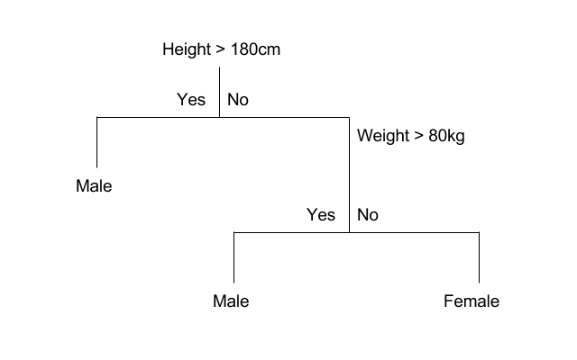

```{r, include=FALSE}
knitr::opts_chunk$set(fig.width=8.5)
```

```{r}
library(rpart)
library(randomForest)
library(ModelMetrics)
library(rpart.plot)

```


# Modelos 
  
O objetivo deste capítulo é dar uma visão geral sobre a estrutura de modelos no R. Isto é, quais são as suas funções básicas, como especificar um modelo, recuperar resíduos, realizar predições etc. Esse processo é parte fundamental de análises mais aprofundadas. Os modelos podem ser usados, de maneira não exclusiva, para exploração de dados, geração de predições e análises de causalidade. Por exemplo: 

* Descritivo: relação entre salários, idade, experiência e anos de estudo; [](http://www.iza.org/teaching/belzil_ss2005/mincernotes.pdf)
* Predição: modelo para identificar risco de fraude em uma transação bancária, classificação de imagens, previsão do PIB para o ano que vem; [](https://research.facebook.com/publications/deepface-closing-the-gap-to-human-level-performance-in-face-verification/)
* Causalidade: aumento de imposto sobre cigarro e redução no consumo. [](http://economics.mit.edu/files/11859)

## Modelo Linear

Vamos introduzir a estrutura de modelos no R a partir de modelos lineares. Trataremos do modelo linear para regressão e do modelo de regressão logística para classificação. O modelo de regressão é utilizado quando a variável de interesse (dependente ou target) é uma variável quantitativa contínua. Por exemplo, salários, preços, notas em um exame etc. Por outro lado, modelos de classificação são utilizados quando a variável de interesse é categórica. Por exemplo: uma pessoa tem ou não tem a doença X, o cliente pagou ou não o cartão de crédito, o usuário X é um robô ou uma pessoa etc.

### Regressão

Vamos começar com o modelo linear de regressão:

$$y_i = \beta_0 + \beta_1 x_{1i} + \beta_2 x_{2i} + ... + \beta_k x_{ki} + \epsilon_i, ~~ i = 1, ..., N,$$
onde $y$ é a variável dependente, $x_{k}$ é a k-ésima variável explicativa, $\beta_k$ é o parâmetro estimado para k-ésima variável e $\epsilon$ é o termo de erro.

A função `lm()` estima esse modelo pelo método denominado de mínimos quadrados ordinários (MQO). Antes de exemplificarmos o uso da função, vamos falar sobre a representação simbólica do modelo, ou seja, como especificar o modelo no R. Em geral, o modelo terá argumentos `x` e `y`, em que o usuário passa os dados nesses argumentos ou terá a estrutura de fórmula. Por ser o método menos usado no modelo linear, detalharemos a estrutura de fórmula. Na função `lm()`, é obrigatório passar-se um objeto da classe fórmula, ou algum objeto que possa ser convertido para uma fórmula. Por exemplo: para o modelo linear com duas variáveis ($y$ e $x$) e uma constante, a fórmula correspondente é:

```{r}
f <- 'y ~ x'
class(f)
class(as.formula(f))
```

Para mostrarmos as possibilidades de uso da fórmula de especificação do modelo, utilizaremos a base `mtcars`. Esta base traz o consumo de gasolina (`mpg`) e algumas outras características do veículo. Detalharemos cada variável explicativa conforme elas são usadas. No entanto, você pode olhar o help dessa base: `?mtcars`. Para iniciarmos, utilizaremos a variável `mpg` (miles per galon) e a variável `hp` (Gross horsepower).

```{r}
data(mtcars)
lm(mpg ~ hp, data = mtcars)
```

Note que não houve especificação de uma constante. Automaticamente, o R inclui a constante. Você pode inclui-la explicitamente ou retirá-la:

```{r, eval=FALSE}
lm(mpg ~ hp + 1, data = mtcars)
lm(mpg ~ hp + 0, data = mtcars)
```

Já temos uma pista de como incluir mais variáveis: basta "adicioná-las" com o símbolo `+`. Isto é, vamos incluir a variável `am` - Transmission (0 = automatic, 1 = manual) - no modelo:

```{r, eval=FALSE}
lm(mpg ~ hp + am, data = mtcars)
```

Se quiséssemos incluir todas as variáveis explicativas:

```{r, eval=FALSE}
lm(mpg ~ ., data = mtcars)
```

Interações:

```{r, eval=FALSE}
lm(mpg ~ hp + am + hp:am, data = mtcars)
```

Transformações:
```{r}
lm(log(mpg) ~ log(hp) + am, data = mtcars)
```

No entanto, algumas transformações podem se confundir com símbolos quem são usados na fórmula. No exemplo abaixo, abstraia os dados e foque no efeito resultante da fórmula:

```{r}
lm(mpg ~ (am + hp)^2 + hp^2, data = mtcars)
```

`(am + hp)^2`, em termos simbólicos, retorna `am + hp + am*hp` e `hp^2` retorna `hp`. No caso em que um símbolo não pode ser usado diretamente, este deve ser usado dentro da função `I()`:

```{r}
lm(mpg ~ hp + I(hp^2), data = mtcars)
```

Variáveis categóricas são convertidas automaticamente para dummies. Por exemplo, vamos adicionar uma variável fictícia chamada `cat`, que receberá valores `a`, `b` e `c` ao data.frame `mtcars`:

```{r, message=FALSE}
library(tidyverse)
mtcars <- mutate(mtcars,
                 cat = sample(c("a", "b", "c"),
                 size = nrow(mtcars), replace = TRUE))
lm(mpg ~ hp + cat, data = mtcars)
```

Falta agora discutir os principais argumentos da função `lm()`:

```{r, eval=FALSE}
lm(formula, data, subset, weights, na.action,
   method = "qr", model = TRUE, x = FALSE, y = FALSE, qr = TRUE,
   singular.ok = TRUE, contrasts = NULL, offset, ...)
```

O argumento `formula` já foi discutido anteriormente. É neste argumento que o modelo é especificado. O argumento `data` recebe (opcionalmente) um data.frame com os dados. O parâmetro data é opcional, porque você pode passar diretamente os vetores de dados. Por exemplo:

```{r}
lm(log(mtcars$mpg) ~ log(mtcars$hp))
```

Continuando, há possibilidade de estimar-se o modelo para um subconjunto dos dados, sendo necessário informar um vetor que selecione as observações que entrarão na estimação, no argumento `subset`. No exemplo que estamos utilizando, suponha que você queira estimar o modelo apenas para os carros automáticos:

```{r}
lm(mpg ~ hp, data = mtcars, subset = (am == 0))
lm(mpg ~ hp, data = mtcars, subset = (am == 1))
```

Há também a possibilidade de utilizar-se um vetor de pesos no argumento `weight` para a estimação de mínimos quadrados ordinários.

Para ver-se um sumário dos resultados da estimação, utiliza-se a função `summary()`:

```{r}
summary(lm(mpg ~ hp, data = mtcars))
```

#### Acessando os resultados

Além do resumo, é possível acessar uma série de objetos gerados pela função `lm()`, como coeficientes, resíduos, valores preditos (dentro do conjunto de estimação) etc. Primeiro, vamos listar esses elementos:

```{r}
fit <- lm(mpg ~ hp, data = mtcars)
is.list(fit)
ls(fit)
```
Como se trata de uma lista, podemos acessar os objetos usando o `$`.

```{r}
fit$coefficients
fit$residuals[1:10]
```

Também existem funções para se acessar esses resultados:

```{r}
coefficients(fit)
residuals(fit)[1:5]
```

#### Predições

No R, para realizar-se predições, utiliza-se a função `predict()`, que é uma função genérica. Isso significa que os seus argumentos e os valores retornados dependem da classe do objeto que estamos passando. No caso de um objeto da classe `lm`, é suficiente passar o próprio objeto.

Abaixo está um exemplo do seu uso:

```{r, message=FALSE}
set.seed(13034) # para replicação
# 70% dos dados
idx <- sample(nrow(mtcars), size = 0.7*nrow(mtcars), replace = FALSE)
train <- mtcars[idx, ]
test <- mtcars[-idx, ]

# 2 Modelos
fit1 <- lm(mpg ~ hp, data = train)
fit2 <- lm(mpg ~ hp + am + disp, data = train)

# Predições
pred1 <- predict(fit1, newdata = test[,-1])
pred2 <- predict(fit2, newdata = test[,-1])

# Comparando Root Mean Square Errors
library(ModelMetrics)
rmse(pred1, test[, "mpg"])
rmse(pred2, test[, "mpg"])
```

### Classificação

Como já mencionado, quando a variável de interesse é categórica, utilizamos modelos de classificação. O modelo linear mais conhecido é o chamado _Regressão Logística_.

Suponha que queremos prever se uma pessoa irá ou não pagar a fatura do cartão de crédito. Definimos como $p$ a probabilidade da pessoa não pagar e como razão de chance (_odds ratio) o valor $\frac{p}{1-p}$. A função logit, por sua vez, é definida como:

$$ logit(p) = log\left(\frac{p}{1-p}\right)$$

Sendo $y$ a nossa variável dependente, vamos definir que ela recebe valor 1 se o cliente não paga e 0 caso contrário. Logo, o modelo linear para o logit é definido como:

$$ logit(p(y = 1|X)) = \beta_0 + \beta_1 x_{1i} + \beta_2 x_{2i} + ... + \beta_k x_{ki}$$

Os parâmetros $\beta's$ são obtidos a partir de métodos de otimização em que o objetivo minimizar é uma função de perda determinada. Note que a probabilidade de ocorrência do evento pode ser calculada como:

$$ p(y = 1|X) = \frac{e^{\beta_0 + \beta_1 x_{1i} + \beta_2 x_{2i} + ... + \beta_k x_{ki}}}{1 + e^{\beta_0 + \beta_1 x_{1i} + \beta_2 x_{2i} + ... + \beta_k x_{ki}}}$$

Um detalhe importante sobre a regressão logística é que este modelo se enquadra na classe de modelos lineares generalizados (generalized linear models - glm). Logo, este modelo pode ser estimado a partir da função `glm()`, escolhendo a família binomial no argumento `family`.

O exemplo a seguir vem do livro [An Introduction to Statistical Learning with Application in R](http://www-bcf.usc.edu/~gareth/ISL/). Utilizaremos o pacote `ISLR` e o conjunto de dados `Smarket` (`?Smarket`). Essa base traz informações sobre as variações do índice S&P 500 entre 2001 e 2005. Este índice é composto por 500 ativos negociados na NYSE ou Nasdaq.

```{r}
library(ISLR)
data("Smarket")
head(Smarket)
```

A base consiste em nove variáveis. A variável de interesse é `Direction` e outras cinco variáveis serão usadas como variáveis explicativas ou preditores. Inicialmente, separaremos nossos dados em treino e teste. Como trata-se de um problema de série temporal, utilizaremos a variável `Year` para separar os dados.

```{r}
train <- Smarket %>% 
  filter(Year <= 2004) %>% 
  select(-Year)
test <- Smarket %>% 
  filter(Year == 2005) %>% 
  select(-Year)
```

Agora vamos estimar o modelo:

```{r}
fit <- glm(Direction ~ . -Today, data = train, family = binomial())
summary(fit)
```

As predições são realizadas com a função `predict()`, mas com o detalhe de que temos que escolher o tipo de predição. O default, `link`, passará o logit. Isto é, o valor da predição linear. Já `response` estimará a probabilidade da observação do evento de interesse. Por fim, `terms` retorna uma matriz com a predição linear para cada variável explicativa. O nosso interesse é na probabilidade do mercado ter subido, logo, usaremos o tipo `response` e transformaremos a probabilidade em `Up` e `Down`.

```{r}
pred <- predict(fit, test, type = 'response')
pred <- ifelse(pred > 0.5, "Up", "Down")
pred <- factor(pred, levels = c("Down", "Up"))
```

Abaixo avaliamos o erro de classificação, que é de, aproximadamente, 52%. Ou seja, pior do que um chute aleatório.

```{r}
# Taxa de erro
ce(test$Direction, pred)
```

Os autores, então, sugerem estimar-se o modelo com apenas duas variáveis.

```{r}
fit <- glm(Direction ~ Lag1 + Lag2, data = train, family = binomial())
pred <- predict(fit, test, type = 'response')
pred <- ifelse(pred > 0.5, "Up", "Down")
pred <- factor(pred, levels = c("Down", "Up"))
# Taxa de erro
ce(test$Direction, pred)
```

Nesse caso, o modelo acertaria 56% das vezes.

### Classificação com modelos baseados em árvores

Uma das limitações da regressão logística é que esse método não vai funcionar bem quando não for possível separar as classes linearmente, como no exemplo abaixo:


```{r}
#### atencao: nao precisam se preocupar em reproduzir o codigo abaixo

# criar matriz de dados aleatorios
mat <- matrix(rnorm(5000, mean = 0, sd = 3), ncol  = 2) %>% as.data.frame()
# criar elipse que circunda 25% dos pontos
el <- car::dataEllipse(mat[, 1],
                       mat[, 2],
                       levels = 0.25,
                       draw = FALSE)
# determinar se um ponto da matriz está dentro da elipse
mat$ta_dentro <- sp::point.in.polygon(mat[,1], mat[,2], el[,1], el[,2])
mat$ta_dentro <- as.factor(mat$ta_dentro)

# construir grafico de pontos, colorindo a elipse
ggplot(mat, aes(x = V1, y = V2, color = ta_dentro)) +
  geom_point()

```


Algoritmos baseados em Decision Trees tentam achar maneiras de criar subsets ou subgrupos do universo dos dados, onde cada subgrupo pertence a um *node*. O objetivo do modelo é criar *nodes* onde haja uma distinção clara entre as classes previstas de forma que possa a cada *node* a probabilidade de um indivíduo pertencer a uma classe. O gráfico abaixo é um exemplo simples e didática de uma árvore de decisão:

```{r, echo = FALSE, fig.cap='Fonte: [Machine Learning Mastery](https://machinelearningmastery.com/classification-and-regression-trees-for-machine-learning/)'}

```


Nesse modelo, que tenta prever o sexo de uma pessoa baseada na altura e no peso, o algoritmo de classificação funciona como uma série de regras **SE-NÃO**:  

* Se a altura for maior que 180cm, o indivíduo é um homem;  
* Se a altura é menor ou igual a 180cm e o peso é maior que 80kg, o indivíduo é homem;  
* Caso contrário, o indivíduo é mulher.  

No R, os modelos de Decision Trees são aplicados principalmente pelo pacote `rpart`. [Este tutorial](https://rpubs.com/H_Zhu/235617) é bem explicativo.


#### Estudo de caso: coleta dos dados e análise exploratória

Como dataset de demonstração para a árvore de decisão, usaremos um bem interessante: Tentaremos entender o que leva um empregado a pedir ou não demissão de sua empresa. Entrem [neste link](https://www.kaggle.com/vjchoudhary7/hr-analytics-case-study), loguem no Kaggle e baixem o dataset para a mesma pasta de trabalho que estão usando no R.

O código abaixo mostra como importar e consolidar todos os datasets em um só dataframe:

```{r, include = FALSE, eval = FALSE}

# importar arquivos referentes ao ponto de entrada
ponto_entrada <- readr::read_csv("dados/hr-analytics-case-study/in_time.csv")

# mudar formato do dataset para o formato tidy (long)
ponto_entrada <- ponto_entrada %>% 
  rename(employee = X1) %>% 
  mutate_at(vars(-employee), as.character) %>% 
  gather(data, horario_entrada, -employee) %>% 
  arrange(employee, data) 

ponto_entrada <- ponto_entrada %>% 
  mutate(horario_entrada = as.POSIXct(horario_entrada))

# fazer o mesmo com o ponto de saída
ponto_saida <- readr::read_csv("data/hr-analytics-case-study/out_time.csv") %>% 
  rename(employee = X1) %>% 
  mutate_at(vars(-employee), as.character) %>% 
  gather(data, horario_saida, -employee) %>% 
  arrange(employee, data) %>% 
  mutate(horario_saida = as.POSIXct(horario_saida))

# juntar os dois datasets para ter o ponto do dia
ponto <- left_join(ponto_entrada, ponto_saida,
                   by = c("employee", "data"))

ponto <- ponto %>% 
  mutate(tempo_trabalho = difftime(horario_saida,
                                   horario_entrada,
                                   units = "hours")) %>% 
  mutate(tempo_trabalho = as.numeric(tempo_trabalho)) %>% 
  filter(!is.na(tempo_trabalho))

# calcular o tempo medio no trabalho por dia dos funcionarios
ponto_agg_ano <- ponto %>% 
  group_by(employee) %>% 
  summarise(
    tempo_medio_trabalho = mean(tempo_trabalho)
  )


emp_pesquisa <- readr::read_csv("data/hr-analytics-case-study/employee_survey_data.csv")
gestor_pesquisa <- readr::read_csv("data/hr-analytics-case-study/manager_survey_data.csv")
geral <- readr::read_csv("data/hr-analytics-case-study/general_data.csv")

# criar um dataset unico
rh <- left_join(geral, emp_pesquisa, by = "EmployeeID") %>% 
  left_join(gestor_pesquisa, by = "EmployeeID") %>% 
  left_join(ponto_agg_ano, by = c("EmployeeID" = "employee")) %>% 
  na.omit() %>% 
  mutate_if(is.character, as.factor)

# salvar os dados
write_rds(rh, "dados/exemplo_classificacao_rh.rds")
```

```{r, eval = TRUE, include = FALSE}
rh <- readr::read_rds("dados/exemplo_classificacao_rh.rds")
```

Vejamos como ficou nosso conjunto de dados:

```{r}
glimpse(rh)
```


```{block, type='warning'}
<strong>Exercícios: </strong>  
- Conheça melhor nossa variável Resposta. Qual o % da base que saiu da empresa (`Attrition` = Yes). Baseado nessa informação, qual o pior modelo aceitável?  
- Quais são as 2 variáveis numéricas que mais influenciam a variável resposta `EmployeeID`? Façam gráficos para investigar essa relação.  
- Façam o mesmo para duas variáveis categóricas.   
</div>
```


```{r, eval = FALSE, include = FALSE}
### contar casos
rh %>% 
  count(Attrition) %>% 
  # calcular percentual
  mutate(pct = n/sum(n))

### variaveis numericas
rh %>% 
  ggplot(aes(x = Attrition, y = tempo_medio_trabalho)) +
  geom_boxplot()

rh %>% 
  ggplot(aes(x = Attrition, y = Age)) +
  geom_boxplot()


### variaveis categoricas
rh %>% 
  ggplot(aes(x = BusinessTravel)) +
  geom_bar(aes(fill = Attrition), position = "fill")


rh %>% 
  ggplot(aes(x = MaritalStatus)) +
  geom_bar(aes(fill = Attrition), position = "fill")

```

#### Criação do modelo

Conforme já comentamos, uma etapa essencial de um projeto de modelagem é criar uma separação de conjuntos de treino e teste.

```{r, include = FALSE}
set.seed(123)
```


```{r}
### separacao de conjuntos de treino e teste

# salvar em um objeto o tamanho vertical do dataframe
n = nrow(rh)
# sortear aleatoriamente 70% das linhas do dataframe para compor
# o conjunto de treino
ind_treino <- sample(1:n, size = n * 0.7)

# criar conjunto de treino
rh_treino <- rh[ind_treino, ]
# criar conjunto de teste a partir da exclusao das linhas do conjunto de treino
rh_teste <- rh[-ind_treino, ]
```


A sintaxe para criar um modelo de Decision Tree no R é bem simples, sendo a mesma da Regressão. A única diferença é que a função usada é `rpart`:


```{r}
# construcao do modelo
mod_arvore <- rpart(Attrition ~ . - EmployeeID, data = rh_treino)

# visualizar o modelo
rpart.plot::prp(mod_arvore, type = 4, extra = 6, fallen.leaves = FALSE, varlen = 0,
                faclen = 0, box.palette = "auto")
```

A árvore ficou meio grande, não? Uma boa alternativa nesse caso é salvar o gráfico da árvore em um pdf no computador:

```{r, eval = FALSE}
# inicializar pdf em branco
pdf("minha_primeira_arvore.pdf")
# preencher pdf com o grafico da arvore
rpart.plot::prp(mod_arvore, type = 4, extra = 6, fallen.leaves = FALSE, varlen = 0,
                faclen = 0, box.palette = "auto")
# destravar a sessao para o pdf ser salvo
dev.off()

```


#### Avaliação do desempenho preditivo de um modelo de classificação:

Vamos avaliar a acurácia do modelo:

```{r}
# criar vetor com previsoes
ycast <- predict(mod_arvore, newdata = rh_teste, type = "class")
yreal <- rh_teste$Attrition

caret::confusionMatrix(data = ycast, 
                       reference = yreal, 
                       positive = "Yes",
                       mode = "everything")

```

Alguns dos conceitos mostrados acima são:

* **Sensitivity** ou **Recall**: De todos os casos que saíram de fato, quantos foram previstas corretamente?
* **Specificity**: De todos os casos que não saíram, quantos foram previstos corretamente?  
* **Accuracy**: De todos os casos, quantos foram previstos corretamente? 
* **Precision**: De todos os casos previstos que não iriam sair, quantos de fato não saíram?   
* **No Information Rate**: Também conhecido como *Null Error Rate*. Qual teria sido a acurácia de um modelo que previsse sempre o caso mais comum?

#### Random Forest

O algoritmo de árvore de decisão, apesar de simples, serviu como base para modelos de árvores mais avançados, generalizáveis e flexíveis. Um deles é o Random Forest, que cria um número $N$ de árvores a partir de uma amostragem de um número $p2 < p1$ de colunas, onde $p1$ é a quantidade total de colunas no conjunto de dados. Os dois livros referenciados são ótimas referências sobre esse algoritmo.

Criar um modelo de Random Forest no R também é muito fácil.

```{r}
# construir modelo
mod_rf <- randomForest::randomForest(Attrition ~ . - EmployeeID,
                                     data = rh_treino,
                                     importance = TRUE)
# obter previsoes a partir do modelo
yhat_rf <- predict(mod_rf, newdata = rh_teste, type = "class")
# obter matriz de confusao
caret::confusionMatrix(data = yhat_rf, reference = yreal)
```

Um recurso muito interessante do modelo Random Forest é o cálculo da importância de cada variável, que é medido com base no impacto de realizar permutações de cada variável explanatória usada no modelo sobre alguma métrica de acurácia. O gráfico abaixo mostra que a maior perda de perfomance preditiva ocorre quando a variável de tempo no trabalho é permutada aleatoriamente:

```{r, fig.height=6}
varImpPlot(mod_rf,
           # especificar que a medida de importancia é a perda media de acuracia
           type = 1,
           main = "Importância de cada variável explan. no modelo de RF")
```

O modelo Random Forest também pode ser usado de maneira probabilística, ou seja, mudando o output para a probabilidade de ele ser sim:

```{r}
yhat_rf_prob <- predict(mod_rf, newdata = rh_teste, type = "prob")

head(yhat_rf_prob)
```


## Exercícios

1. Utilizando a base de dados `Wage`, do pacote `ISLR`, crie dois data.frames: um com 70% dos dados (`train`) e outro com 30% (`test`).

2. Crie um novo objeto chamado `fit`, a partir da função `lm()`. Use como variável dependente ($Y$) a coluna `logwage` e escolha outras três colunas como variáveis explicativas.

3. Compute as predições desse modelo utilizando a função `predict()`.

4. Compute a raiz do erro quadrático médio (rmse). (`ModelMetrics::rmse()`).

5. Inclua outras variáveis e cheque o que acontece com o `rmse`.

```{r}
library(ISLR)
library(ModelMetrics)

idx <- sample(nrow(Wage), 0.7 * nrow(Wage))
train <- Wage[idx, ]
test <- Wage[idx, ]

fit <- lm(logwage ~ age + education + maritl + health_ins, data = train)
pred <- predict(fit, test)

rmse(actual = test$logwage, predicted = pred)
```
